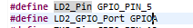
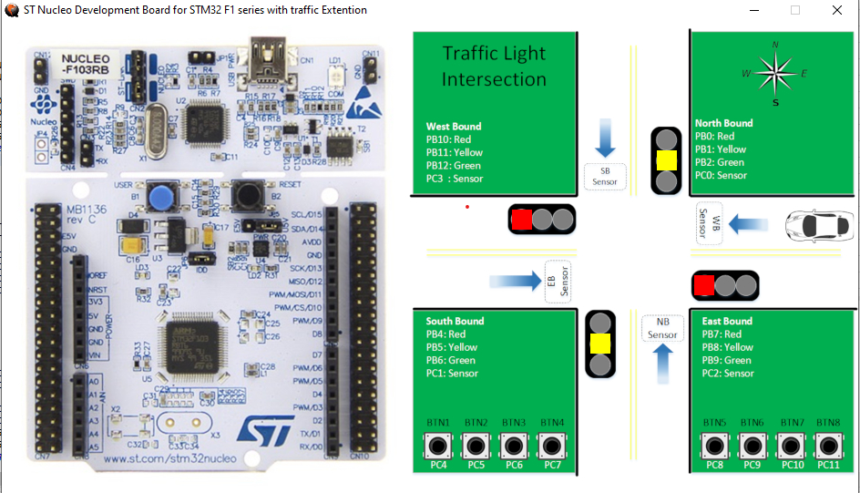

# Traffic-Light-Simulator
## Wallace Obey

## Introduction
The goal of this lab is to gain famililarity with the STM32 NUCLEO-F103RB board, QEMU system simulator, and the state machine design pattern. The layout of the chip (pins, buttons, LEDs etc..), QEMU interface/simulator, and logic of designing finite state machine  (FSM) were all explored. An embedded hello world and traffic light simulator were created to demonstrate concepts learned in this lab. 

The STM32 NUCLEO-F103RB board is part of the NUCLEO board family. An image of the board can be seen below

 

Figure 1: Image of STM32 NUCLEO-F103RB

Some features that standout from this board are its wifi and bluetooth capabilities, ability to handle real time softwarte applications, and powerful processor. 

The QEMU (Quick EMUlator) is a full system emulator and virtualizer. QEMU can emulate a full device, memory, CPU, or operating system. In this lab, QEMU is used to simulate the traffic intersection. 

The last thing covered in this lab are finite state machines. Finite-State Machines (FSMs) is a design pattern used to describe the behavior of a system (software, electrical, mechanical, etc). In this lab, FSMs will be used to describe the traffic ligh intersection  and as a way to develop software for the system.  

## Embedded Hello World
The first project is the hello world simulation. A new project was created and the NUCLEO-F103RB board was selected for hardware simulation. The image below showes the chip and all its pins/access points. 

Figure 2: Chip layout in software 

For this introductory project, the goal is to get the green LED to blink. From looking at figure 2, we see the green LED is set to PA5 (pin 5). Also pin 5 is configured to be an output. This makes sense because an LED isn't an input. we want to make that pin high so the output can be reflected through the LED (light turing on). A schematic of the full board can be seen in the figure bellow. A referecne to the proper source can be seen in the image. 

Figure 3: Board Schematic

Pin PA5 can be seen right below the title (next to pin PA6 and PA7). These pins were defined in software under the provate defines section and can be seen below. 

Figure 4: LED Defines in Software 

There are 5 GPIO groups (GPIOA, GPIOB, GPIOC, GPIOD, GPIOE). This LED is matched to GPIOA and pin 5 (PA5). 

The functions used in this lab for interfacing with the pins are hardware are called HAL function. HAL stands for Hardware Abstraction Layer. STM32Cube family of software created this standard as a way to keep the software development simple across multiple hardware platforms (various boards etc.). The code for the first lab can be seen below. 

Figure 5: Blink Hello World

The HAL_GPIO_WritePin() function tells pin5 to go high. This command will "set the pin" or turn the LED on. The next line, HAL_Delay(), tells how long the pin5 should stay high for (1 second). The Third line of the write function will "reset the pin" or turn the LED off. The last line, HAL_Delay() tells us how long we want the function to be low for (1 second). A screenshot of the systesm can be seen below

Figure 6: LED Blink

The next part of the lab was to explore inputs as a way to control the LED. Pin 13 was declared an input for this and the software definitions can be seen below. 

Figure 7: Input Definitions

Notice how this is uses GPIOC and pin13. The code for this section can be seen below 

Figure 8: Code for User Input

As described in the comments, this section of code attemps to fix a bug in the QEMU simulator on line 95-96. The next step is to set a while loop and wait for the user to press the button. When the button is pressed, a write function is called to make the green LED turn on (go high). This demonstrated the three key features needed for the final project of this lab section (turning an LED on, getting user input, and configuring the QEMU simulation). In the next section an FSM will be implemented along with these three features to create a traffic light simulation. 

## Traffic Light Intersection System

In this section, a traffic light simulator was built to demonstrate all topcis covered so far. 

NOTE: The Free RTOS timers were not implemented but their functions were thoroughly understood and will be explained later.

As mentioned earlier, an FSM of a traffic light intersection was implemented. The FSM can be seen below. 

Figure 9: FSM Diagram for Reference

The FSM has eight states: NS_GO, NS_GO_Change_Rdy, NS_Stopping, NS_Stopped, EW_GO, EW_GO_Change_Rdy, EW_Stopping, and EW_Stopped. The NS states correspond to the North and South bound traffic flow while EW symbolizes East and West traffic flow. Each state has a specificed amount of time to be in with or without sensor input. The two states the require sensor input (a car pulls up) are the NS_GO_Change_Rdy and the EW_GO_Change_Rdy states. 

NOTE: This FSM was only a reference. For the actual implemenation, 15 seconds for the 60 second states was used, 10 seconds for the 10 secodns states, and 5 secodns for the 2 seconds states. This was to make debugging faster while using the GDB QEMU debugger.

A new project was created and configuration were set up. For this project, a traffic light overlay was used to help visualize the system. The overlay diagram can be seen below. 

Figure 10: Overlay for Traffic Simulation

The illustration of the intersection can be seen in the picture. From the picture, there is a lot of pin, buttons, and leds to setup. The chart below shows everything that has to be taken into account. 

Figure 11: Chart of all Pins, LEDs, and Buttons to Setup

There were a few ways this could be implemented. One route to take was to manually define everything. This would require a lot of editing of files. The way chosen was to use the code generation feature of STM32Cube IDE. Figure 11 shows everything that needs to be setup. Looking back at figure 2: Chip layout, it was observed that the chip matches up with the ports assigned to chart in figure 11. The chip was then configured to match up with figure 11. The diagram can be seen below. 

Figure 12: Chip with everything configured.

From the figure, each pin was able to be configured as input, output, or timmers (input are buttons and sensors while outputs are LEDs). As a result, private defines were generated and used. The private defines can be seen below. 

Figure 13: Private Defines from Code Generation.

The next part of this project was to build the FSM. The FSM was build and tested as each new state was implemented. The next group of figures shows the final code developed for each state. An enum and case statement were the foundaton of this design. This idea was drawn from https://aticleworld.com/state-machine-using-c/ and https://www.adamtornhill.com/Patterns%20in%20C%202,%20STATE.pdf. 

The first thing made was an enum for each state. This code can be seen below. 

Figure 14: Traffic Light ENUM

Each state is defined by this enum. The initial state will be the NS_GO (will be seen next). Each state of the enum was written according to the FSM in Fiugre 9. The code for NS_Go can be seen below

Figure 15: NS_GO_CODE

In this state we turn off the red light for north south and turn on the green light. We do this becuase the previous state is east west stopped (everything is red). A simulation screenshot can be seen below

Figure 16: NS_GO_SIM

The next state is the NS_GO_Change_Rdy state. In this state, There are two paths of logic. One logic is for the car sensor and one for regular waiting. About two seconds is allocated for user input (car detected on east west bound traffic). The logic is then carried out for setting the state and delay is activated. 

NOTE: RTOS timers wasn't used here. If the timer was used, then (from my understanding) there could be one timer for the the no input case and another timer for the input case. This way the os could keep track of the time time elapsed while other inputs could be serviced. 

Figure 17: NS_GO_Change_Rdy_CODE

The next figure shows the simulation. The lights don't change but it's important to paya attention to the console window. This window shows when the 
car sensor button is pressed. 

Figure 18: NS_GO_Change_Rdy_SIM

The NS_Stopping state is next to be examined. In this state, the north and south bound lights are switched to yellow through similar logic as the previous state and the delay is done.  

Figure 19: NS_Stopping_CODE

The Simulation can be seen below. 

Figure 20: NS_Stopping_SIM

In the NS_Stopped state, every traffic signal is now red for a short time (five seconds per my specifications). Code is below 

Figure 21: NS_Stopped_CODE

The simulation is next

Figure 22: NS_Stopped_SIM

Now that north and south bound signals are red, the next thing to do is to set the east and west signals to green for the speficied amount of time. The next figure (code) shows this. one again it's important to note how the traffic signal is turned off (red light is off) then the green signal is turned on. If this is not done then both red and green lights will be on (I had this issue for a bit but figured it out with the debugger). 

Figure 23: EW_GO_CODE

The next figure shows the green lights on east and west bound signals

Figure 24: EW_GO_SIM

In this state, east-west bound change ready state, we will be expecting a car sensor from north-south bound traffic. This is the same logic as the north-south bound change ready state from earlier. 

Figure 25: EW_GO_Change_Rdy_CODE

The simulation can be seen below. Similar to the north-south bound change ready state, we look at the console for the input. 

Figure 26: EW_GO_Change_Rdy_SIM

 In the east-west stopping state, we have east-west signals turnign yellow. The code and figures can be seen below. 

Figure 27: EW_Stopping_Code

Figure 28: EW_Stopping_SIM

Finally, the east-west stopped state. In this state, everything is red. This is the same as the north-south stopping state.

Figure 29: EW_Stopped_Code

Figure 30: EW_Stopped_SIM

These are all the states summaried. 

## Conclusion
This project thoroughly demonstrates how the microcontroller, QEMU system simulator, and FSM came together to create a traffic simualtor. For more inforamtion visit https://github.com/wobey96/Traffic-Light-Simulator. There is a working demo of the simulator. 
